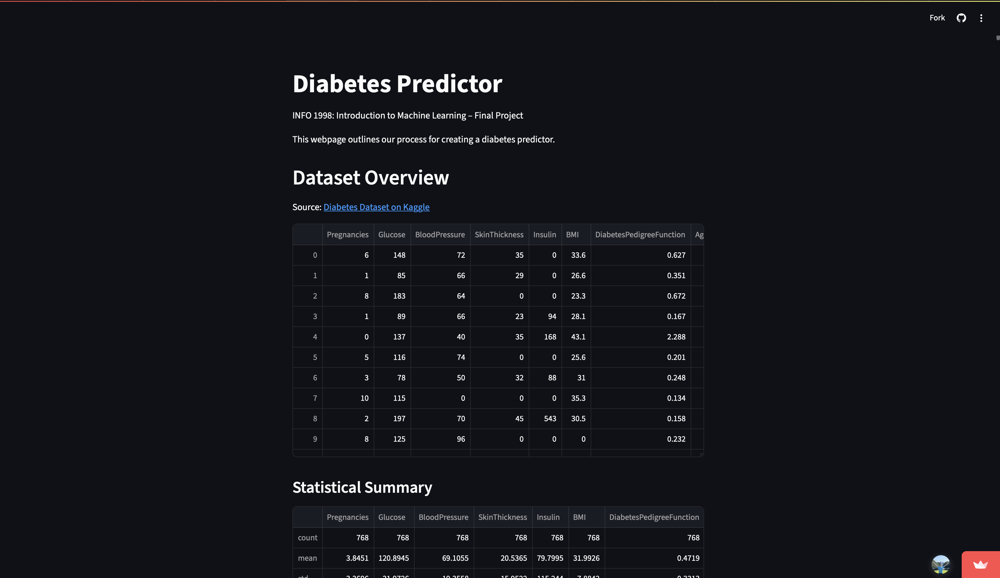

# ML-Final-Web  
**INFO-1998 Final Project**  
A web based machine learning application for predicting diabetes risk using a user friendly interface.

---

## Overview  
[ML-Final-Web](https://github.com/Naijei1/ML-Final-Web) is a final project for INFO-1998, developed to demonstrate the integration of machine learning models into a web application. The project utilizes a dataset containing various health metrics to predict the likelihood of diabetes in individuals.  

**Live Demo:** [https://info1998-final.streamlit.app/](https://info1998-final.streamlit.app/)

---

## Features  
- **User Input Interface**: Allows users to input health metrics through a simple web form.  
- **Model Prediction**: Utilizes a trained machine learning model to predict diabetes risk based on user inputs.  
- **Result Display**: Presents the prediction results in an easily understandable format.

---

## Tech Stack  
- **Backend:** Python (Streamlit)  
- **Machine Learning:** Scikit-learn
- **Data Handling:** Pandas and NumPy
- **Deployment:** Streamlit Cloud

---
## Acknowledgments
- INFO-1998 for providing the course framework and guidance
- CDS (Cornell Data Science) and Sri Kundurthy for providing guidance and support throughout the entire project
